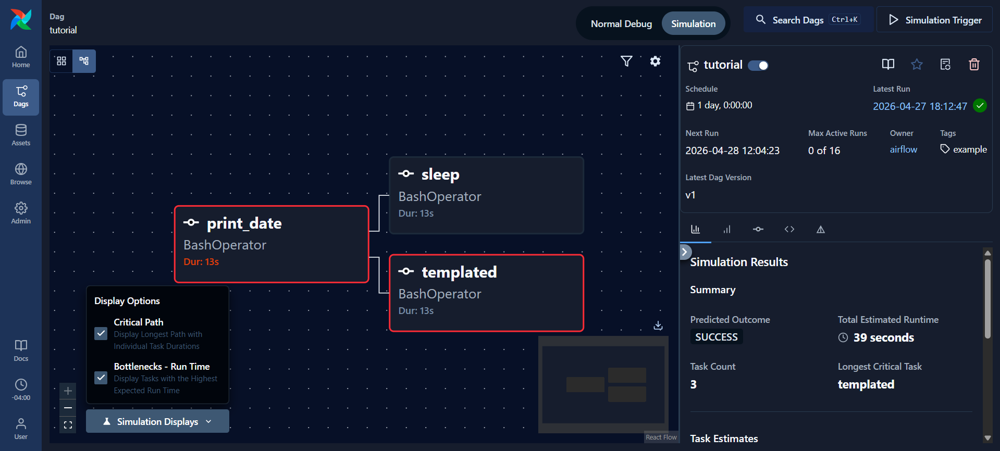
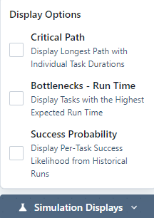
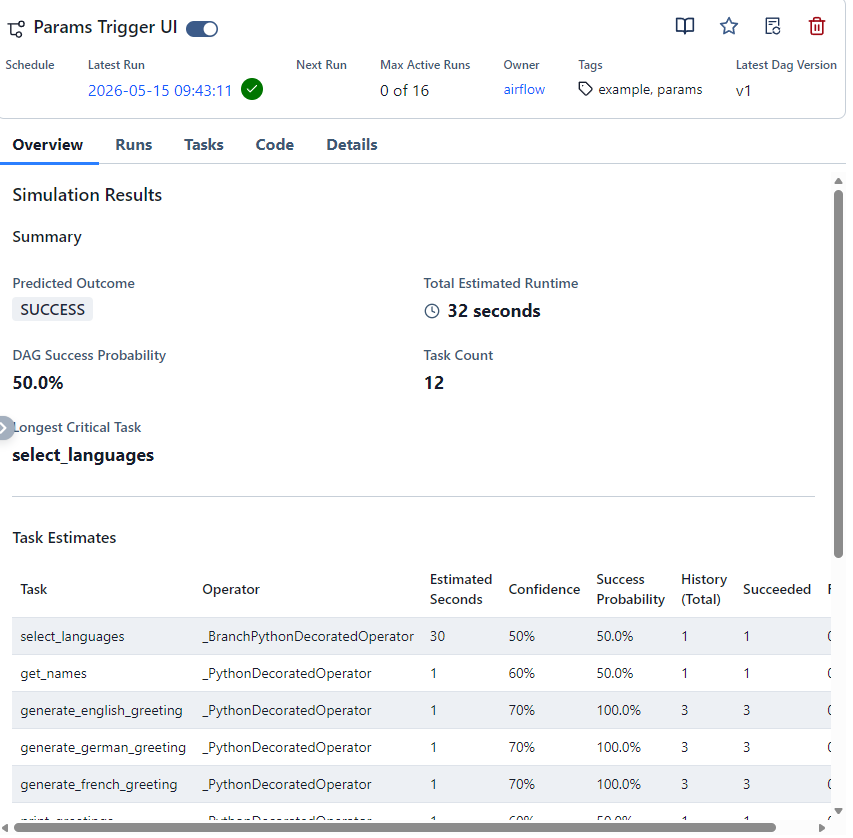

# Frontend

## Key Components

| Component | Purpose |
|---|---|
| Simulation Mode Toggle | Top-nav toggle switching modes; updates URL prefix to `/simulation` |
| Simulation Trigger Button | Calls `/simulate` REST endpoint; fires `airflow:simulation-triggered` browser event |
| Detail Side Panel | Displays Summary, Task Estimates, and Display Options |
| `Simulation.tsx` | Fetches and holds simulation report data in local state via `useState` |
| `Overview.tsx` | Listens for `airflow:simulation-triggered` to refresh simulation data |
| `simulationDisplay.ts` | Manages overlay state (critical path, bottleneck) via URL search parameters |

---

## State Management

### Server-Side

Simulation results are stored in memory inside `simulation.py` as a dictionary
mapping `simulation_id` to simulation report. Results are **not** shared across
multiple API workers and will be **lost on server restart**.

### Client-Side

- `simulation_id` is carried in the page URL as `?simulation_id=...`
- Fallback: `localStorage` stores the most recent simulation per DAG under
  `airflow.latestSimulation.{dagId}`
- React pages hold simulation data in local component state, refreshing whenever
  `dagId` or `simulation_id` changes
- The Simulation Trigger button fires the `airflow:simulation-triggered` custom browser
  event; Grid, Graph, and Overview components listen and auto-refresh

### Routing

The `isSimulating` flag is propagated across all routes so that links to task groups
and task instances are conditionally prefixed with `/simulation`. This prevents
navigation within Simulation Mode from redirecting users to Normal Mode.

### Display Overlays

Graph overlays are controlled via URL search parameters managed by `simulationDisplay.ts`.
Overlay state (critical path on/off, bottleneck on/off) is preserved in the URL and
can be shared or bookmarked independently of simulation results.

---

## UI Screenshots

