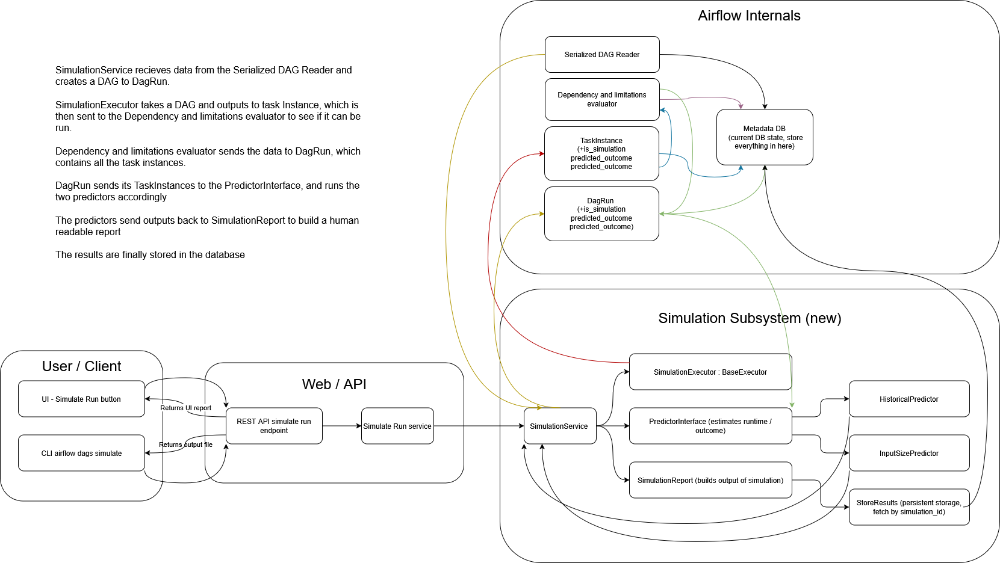
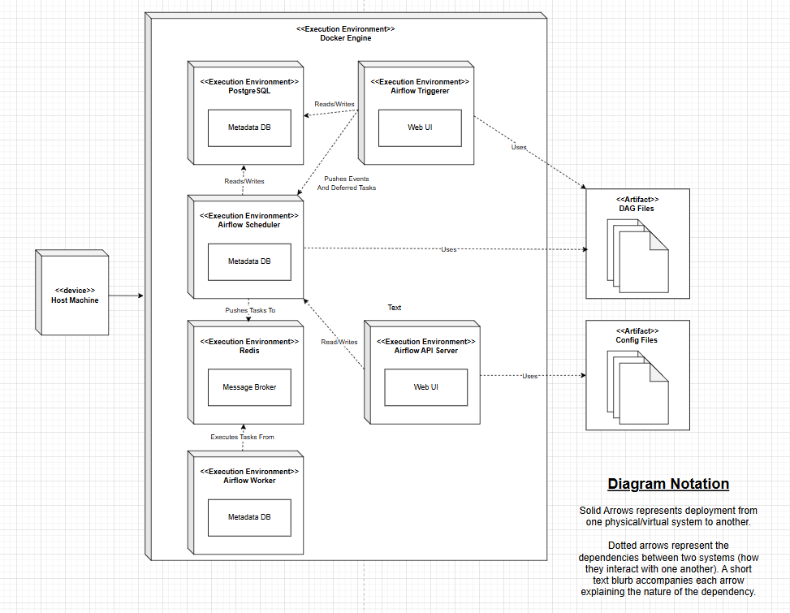

# System Design

## Subsystems

The simulation feature consists of five major subsystems.

### 1. Simulation Executor

`SimulationExecutor` extends Airflow's `BaseExecutor`. When a simulation is triggered,
it intercepts all task execution calls, mocks task results, and prevents real resource
usage or side effects. It aggregates task-level estimates into a DAG-level prediction
and populates `is_simulation`, `estimated_runtime`, and `predicted_outcome` on
`TaskInstance` and `DagRun` via an Alembic migration.

### 2. Prediction Engine

Implements a four-level fallback chain:

| Level | Source | Confidence |
|---|---|---|
| 1 | Exact `(dag_id, task_id)` historical match | High |
| 2 | Cross-DAG fingerprint match (operator type + task content hash) | Medium-High |
| 3 | Operator-type average across all DAGs | Medium |
| 4 | Deterministic heuristic (hardcoded constant per operator type) | Low |

Supported aggregation methods: median, mean, p90, p95.

### 3. Historical Data Layer

Queries Airflow's PostgreSQL metadata database via SQLAlchemy to extract past task
execution records. Supports filtering by date range, task state, and DAG version.
Automatically excludes rows where `is_simulation=True`.

> PostgreSQL (versions 14–18) is required. The team developed and tested against
> PostgreSQL 18. SQLite is not supported for the historical data layer in production.

### 4. REST API Layer

FastAPI endpoints:

| Endpoint | Method | Description |
|---|---|---|
| `/api/v2/dags/{dagId}/simulate` | `POST` | Triggers simulation; returns predicted outcome, estimated runtime, per-task estimates, critical path, bottlenecks |
| `/api/v2/dags/{dagId}/simulation/results` | `GET` | Retrieves a past simulation result by `simulation_id` |

### 5. Frontend UI

React/TypeScript extension to Airflow's existing web interface:
- Normal / Simulation toggle in the top navigation bar
- `/simulation` URL prefix propagated via `isSimulating` flag across all routes
- Detail Side Panel with Summary, Task Estimates, and Display Options sections
- Simulation Trigger button — initiates simulation without creating a real DAG run

---

## Architecture Diagrams

### Component Diagram



### Deployment Diagram



---

## Directory Structure

The simulation feature is integrated directly into the Apache Airflow monorepo.
New code lives in clearly scoped subdirectories under `airflow-core/`, while modifications
to existing Airflow files are kept minimal and additive.

```text
airflow/
├── airflow-core/
│   ├── src/airflow/
│   │   ├── simulation/                              ★ new
│   │   │   ├── service.py, planner.py, executor.py, report.py, store.py
│   │   │   ├── critical_path.py, bottleneck.py, fingerprint.py
│   │   │   ├── predictors/  (interface, constant, historical, success)
│   │   │   └── data/  (historical_data_extractor.py)
│   │   ├── models/taskinstance.py, dagrun.py        △ modified
│   │   ├── api_fastapi/core_api/routes/public/simulation.py  ★ new
│   │   ├── cli/commands/dag_command.py              △ modified
│   │   └── migrations/versions/XXXX_add_simulation_columns.py  ★ new
│   └── tests/unit/
│       ├── simulation/  (mirrors src/airflow/simulation/ layout) ★ new
│       ├── api_fastapi/.../test_simulation.py       ★ new
│       ├── models/test_taskinstance_simulation.py   ★ new
│       └── migrations/test_simulation_migration.py  ★ new
├── airflow-ui/src/
│   ├── pages/Simulation.tsx ★, Overview.tsx △
│   ├── components/SimulationModeToggle, SimulationTriggerButton,
│   │              DisplayOptionsPanel ★ — DetailSidePanel, Graph, Grid △
│   └── utils/simulationDisplay.ts                   ★ new
└── docs/simulation/                                 ★ new
```

**Directory conventions:** New code is grouped into self-contained subdirectories so the
simulation feature can be reasoned about — or removed — as a single unit. Modifications
to existing Airflow files are kept additive (new columns, new methods, new conditional
branches) rather than rewriting existing logic. Test files mirror source layout so any
test can be located by transforming a source path into its corresponding test path.

---

## Simulation Execution Flow

When a simulation is triggered, the `SimulationService` orchestrates the following steps:

1. Load the latest DAG structure and task instances from the metadata database
2. For each task, invoke the prediction engine to calculate estimated runtime, confidence score, and predicted outcome using the four-level fallback chain
3. Compute the critical path across all tasks using Kahn's topological sort algorithm
4. Identify the bottleneck task (the task on the critical path with the highest individual estimated runtime)
5. Calculate the DAG-level success probability from task and `DagRun` historical data
6. Persist the full simulation report to `simulation_result` and `simulation_task_result` in PostgreSQL
7. Return the structured JSON report to the client and update the frontend display

---

## Component Table

| Component | Responsibility |
|---|---|
| Frontend UI | Renders simulation results, runtime estimates, critical path highlights, and bottleneck overlays |
| Simulation Engine | Intercepts and mocks task execution; aggregates task-level estimates into DAG-level predictions |
| DAG Parser | Builds dependency graph, computes topological sort via Kahn's algorithm, identifies critical path and bottleneck tasks |
| Database Layer | Queries and stores historical task runtimes; supplies the prediction engine with confidence-scored estimates |

---

## Core Design Decisions

### In-Memory Simulation Result Storage

Simulation results are stored in memory inside `simulation.py` as a dictionary mapping
`simulation_id` to simulation report. This keeps the implementation simple and avoids
adding a new persistence layer. The trade-off is that results are not shared across
multiple API workers and will be lost on API server restart. The client mitigates this
by storing the most recent `simulation_id` per DAG in `localStorage` under
`airflow.latestSimulation.{dagId}`, allowing the user to re-trigger if needed.

### Kahn's Algorithm for Critical Path

The DAG Parser uses Kahn's algorithm to compute a topological ordering of tasks, then
performs a longest-path traversal over that ordering to identify the critical path.
This approach handles arbitrary DAG shapes (linear, branching, converging) correctly,
uses the maximum parallel branch duration rather than the sum, and raises immediately
on cycle detection before the algorithm runs.

### PostgreSQL Requirement

The historical data layer relies on SQLAlchemy queries against Airflow's metadata
database. SQLite does not support the query patterns (window functions, date range
filtering, result ordering) required for reliable historical extraction at scale.
PostgreSQL (versions 14–18) is therefore required for any deployment using the
historical predictor; the team developed and tested against PostgreSQL 18.
SQLite remains usable for unit tests via mocked database calls or Airflow's
`dag_maker` fixture.

### URL-Based Overlay State Management

Graph overlays (critical path, bottleneck) are controlled via URL search parameters
managed by `simulationDisplay.ts` rather than component-local state. This means overlay
configuration is preserved across page refreshes and can be shared or bookmarked simply
by copying the page URL.
